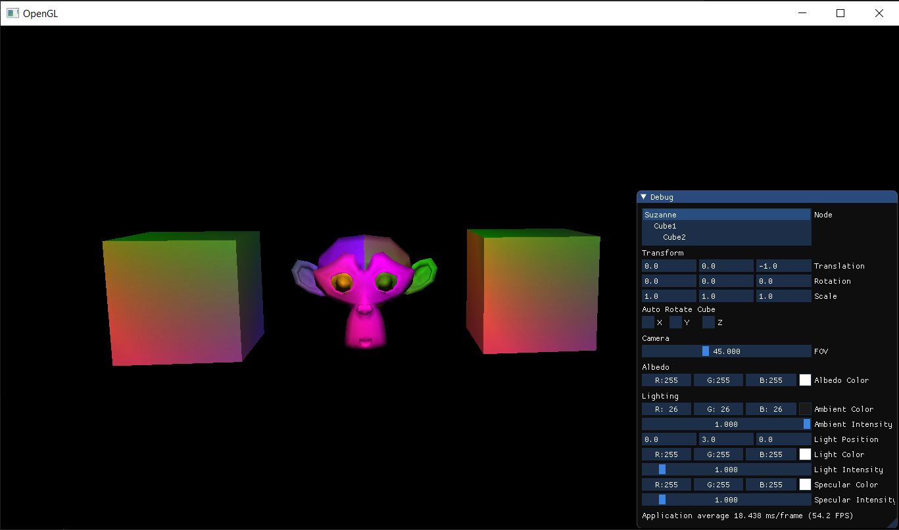

# OpenGL Demo

An OpenGL demo which covers aspects such as:
- Basic scene setup
- Inspector menu for quick debugging
- Multiple objects and heirarchy among them
- Basic point light, ambient light and specular lighting

